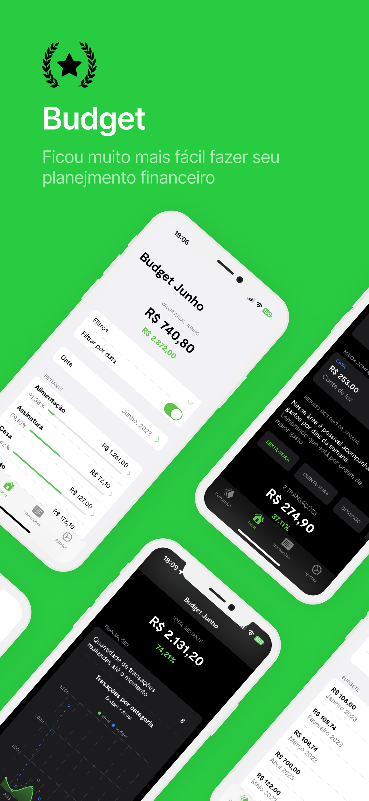
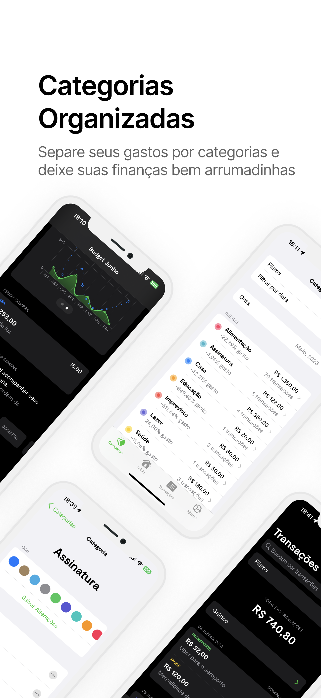
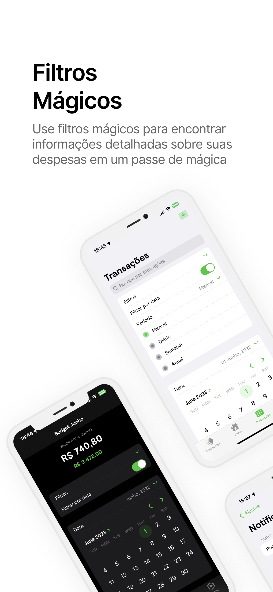

# Refds Budget

   

Budget is the perfect app for those tired of dealing with their finances in a confusing and disorganized manner. With it, you can easily plan your monthly expenses, dividing them into different categories for better tracking and organization.

The app allows you to access detailed reports on your spending, which helps maintain financial control and prevents unnecessary expenses. Additionally, Budget is user-friendly and intuitive, making it an essential tool for anyone looking to keep their finances in check.

With Budget, you no longer need to worry about losing control of your money. The app enables you to stay on top of your finances, with the ability to adjust your expenses according to your financial reality.

If you want to manage your finances intelligently and effectively, Budget is the perfect solution. Don't waste any more time, download Budget now from the Apple Store and start taking full control of your finances!
